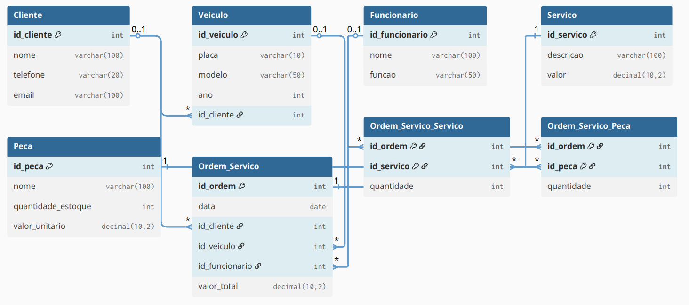

## Projeto de Modelagem de Dados para Oficina Mecânica

### 1. Contexto e Objetivo
Este projeto tem como objetivo criar um banco de dados relacional para uma oficina mecânica, contemplando desde a modelagem conceitual até a implementação física e elaboração de consultas SQL para análise e gestão dos dados.

### 2. Etapas do Projeto
1. Modelagem conceitual (ER): Identificação das entidades e relacionamentos principais.
2. Modelagem lógica: Definição das tabelas, atributos, chaves primárias e estrangeiras.
3. Implementação física: Criação do banco de dados via script SQL.
4. Persistência de dados: Inserção de dados para testes.
5. Consultas SQL: Queries para responder perguntas relevantes ao negócio.

### 3. Modelo Lógico
O sistema registra clientes, veículos, funcionários, ordens de serviço, serviços realizados e peças utilizadas, permitindo consultas gerenciais e operacionais.



**Entidades e relacionamentos:**
- Cliente (id_cliente, nome, telefone, email)
- Veículo (id_veiculo, placa, modelo, ano, id_cliente)
- Funcionário (id_funcionario, nome, função)
- Serviço (id_servico, descricao, valor)
- Peça (id_peca, nome, quantidade_estoque, valor_unitario)
- Ordem de Serviço (id_ordem, data, id_cliente, id_veiculo, id_funcionario, valor_total)
- Ordem_Servico_Servico (id_ordem, id_servico, quantidade)
- Ordem_Servico_Peca (id_ordem, id_peca, quantidade)

**Exemplo de esquema lógico (modelo relacional):**
```sql
CREATE TABLE Cliente (
  id_cliente INT PRIMARY KEY,
  nome VARCHAR(100),
  telefone VARCHAR(20),
  email VARCHAR(100)
);

CREATE TABLE Veiculo (
  id_veiculo INT PRIMARY KEY,
  placa VARCHAR(10),
  modelo VARCHAR(50),
  ano INT,
  id_cliente INT,
  FOREIGN KEY (id_cliente) REFERENCES Cliente(id_cliente)
);

CREATE TABLE Funcionario (
  id_funcionario INT PRIMARY KEY,
  nome VARCHAR(100),
  funcao VARCHAR(50)
);

CREATE TABLE Servico (
  id_servico INT PRIMARY KEY,
  descricao VARCHAR(100),
  valor DECIMAL(10,2)
);

CREATE TABLE Peca (
  id_peca INT PRIMARY KEY,
  nome VARCHAR(100),
  quantidade_estoque INT,
  valor_unitario DECIMAL(10,2)
);

CREATE TABLE Ordem_Servico (
  id_ordem INT PRIMARY KEY,
  data DATE,
  id_cliente INT,
  id_veiculo INT,
  id_funcionario INT,
  valor_total DECIMAL(10,2),
  FOREIGN KEY (id_cliente) REFERENCES Cliente(id_cliente),
  FOREIGN KEY (id_veiculo) REFERENCES Veiculo(id_veiculo),
  FOREIGN KEY (id_funcionario) REFERENCES Funcionario(id_funcionario)
);

CREATE TABLE Ordem_Servico_Servico (
  id_ordem INT,
  id_servico INT,
  quantidade INT,
  PRIMARY KEY (id_ordem, id_servico),
  FOREIGN KEY (id_ordem) REFERENCES Ordem_Servico(id_ordem),
  FOREIGN KEY (id_servico) REFERENCES Servico(id_servico)
);

CREATE TABLE Ordem_Servico_Peca (
  id_ordem INT,
  id_peca INT,
  quantidade INT,
  PRIMARY KEY (id_ordem, id_peca),
  FOREIGN KEY (id_ordem) REFERENCES Ordem_Servico(id_ordem),
  FOREIGN KEY (id_peca) REFERENCES Peca(id_peca)
);
```

### 4. Criação do Banco de Dados
O arquivo `schema.sql` contém o script SQL para criar todas as tabelas e relacionamentos do banco de dados da oficina mecânica. Para iniciar o projeto, execute o conteúdo desse arquivo em seu SGBD (MySQL, PostgreSQL, etc.) para estruturar o banco conforme o modelo lógico apresentado.

### 5. Geração de Dados de Teste
Para popular o banco de dados com muitos dados de teste, utilize o script `gerador_de_dados.py` presente no projeto. Ele gera comandos SQL de inserção para todas as tabelas, compatíveis com o modelo lógico.

**Como gerar o arquivo de dados:**
```bash
python gerador_de_dados.py > data.sql
```
O arquivo `data.sql` será criado com milhares de registros para clientes, veículos, funcionários, serviços, peças, ordens de serviço e suas relações. Basta executar esse arquivo SQL no seu banco para popular todas as tabelas.

### 6. Consultas e Análise de Dados
O arquivo `query.sql` contém exemplos de consultas SQL que podem ser utilizadas para analisar e extrair informações relevantes do banco de dados da oficina. As queries respondem perguntas sobre clientes, faturamento, peças, funcionários, veículos e serviços, utilizando cláusulas como SELECT, WHERE, GROUP BY, HAVING, ORDER BY, JOIN e LIMIT.

Para executar as consultas, basta rodar o conteúdo de `query.sql` no seu SGBD após popular o banco com os dados de teste. As perguntas respondidas incluem:
- Quais clientes mais utilizaram os serviços da oficina?
- Qual o faturamento mensal da oficina?
- Quais peças foram mais utilizadas em determinado período?
- Quais funcionários realizaram mais atendimentos?
- Quais veículos passaram por revisões completas?
- Qual o histórico de serviços de um determinado cliente?
- Faturamento por funcionário
- Peças com estoque baixo
- Clientes com muitos veículos cadastrados
- Serviços mais realizados

Essas consultas podem ser adaptadas conforme a necessidade de análise do projeto.

### 7. Exemplos de Resultados das Consultas
Ao executar as consultas presentes em `query.sql` sobre o banco populado com os dados gerados, é possível obter resultados como:
- **Clientes mais frequentes:** Listagem dos nomes dos clientes que mais abriram ordens de serviço, útil para identificar o perfil dos principais consumidores da oficina.
- **Faturamento mensal:** Tabela com o valor total faturado em cada mês, permitindo análise de sazonalidade e desempenho financeiro.
- **Peças mais utilizadas:** Relação das peças com maior uso em serviços, auxiliando no controle de estoque e compras.
- **Funcionários mais produtivos:** Ranking dos funcionários que mais atenderam ordens, útil para reconhecimento e gestão de equipe.
- **Veículos com maior histórico de serviços:** Identificação de veículos que passaram por diversas revisões ou manutenções, importante para acompanhamento de clientes recorrentes.
- **Histórico detalhado de serviços de um cliente:** Visualização das ordens, datas, serviços realizados e quantidades para um cliente específico.
- **Faturamento por funcionário:** Comparativo do valor total gerado por cada colaborador.
- **Peças com estoque baixo:** Lista de peças que precisam ser repostas, facilitando a gestão do almoxarifado.
- **Clientes com muitos veículos cadastrados:** Identificação de clientes com frota própria ou empresas parceiras.
- **Serviços mais realizados:** Ranking dos tipos de serviços mais executados na oficina.

Esses resultados permitem uma visão ampla e detalhada do funcionamento da oficina, apoiando decisões estratégicas, operacionais e comerciais.